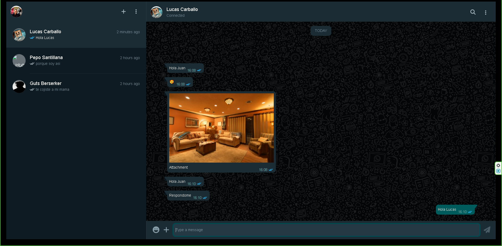

# WhatsApp Clone - Backend

Este es el backend de un clon de WhatsApp desarrollado como proyecto Full Stack usando **Spring Boot 3** y **Angular 18**. La aplicación permite una comunicación en tiempo real similar a la de WhatsApp, con autenticación y gestión de usuarios mediante **Keycloak**.

 <!-- Reemplaza con la ruta de tu imagen -->

## Tabla de Contenidos
- [Características Clave](#características-clave)
- [Requisitos Previos](#requisitos-previos)
- [Instalación](#instalación)
- [Uso](#uso)
- [Tecnologías Utilizadas](#tecnologías-utilizadas)

## Características Clave
- 💬 **Mensajería en tiempo real**: Comunicación instantánea y fluida entre usuarios.
- 👥 **Gestión de conversaciones**: Organización y administración de chats.
- 📁 **Compartir archivos**: Soporte para imágenes, videos y documentos.
- 🔐 **Autenticación y autorización**: Gestión de roles y autenticación segura con Keycloak (OAuth2).
- 🏢 **Arquitectura hexagonal**: Diseño para alta escalabilidad y fácil mantenimiento.

## Requisitos Previos
- **JDK 21**
- **PostgreSQL**
- **IDE** (VSCode, IntelliJ)
- **Docker** (Docker Desktop)

## Instalación
Clona el repositorio en tu máquina local:

```bash
git clone https://github.com/C0de-cake/whatsapp-clone-back
```

### Ejecución
1. **Configura Keycloak**:
   Ejecuta el servicio de Keycloak usando Docker Compose:

   ```bash
   docker-compose -f src/main/docker/keycloak.yml up -d
   ```

2. **Inicia el backend**:
   - **Con Maven**:
     ```bash
     ./mvnw spring-boot:run -Dspring-boot.run.arguments="--AUTH0_CLIENT_ID=<client-id> --AUTH0_CLIENT_SECRET=<client-secret>"
     ```

   - **Con IntelliJ**:
     Agrega las variables de entorno necesarias en la configuración de ejecución y luego inicia el proyecto desde IntelliJ.

## Tecnologías Utilizadas
- **Backend**: Spring Boot 3, PostgreSQL
- **Frontend**: Angular 18, Bootstrap
- **Autenticación**: Keycloak (OAuth2)
- **Infraestructura**: Docker para despliegue y desarrollo local
